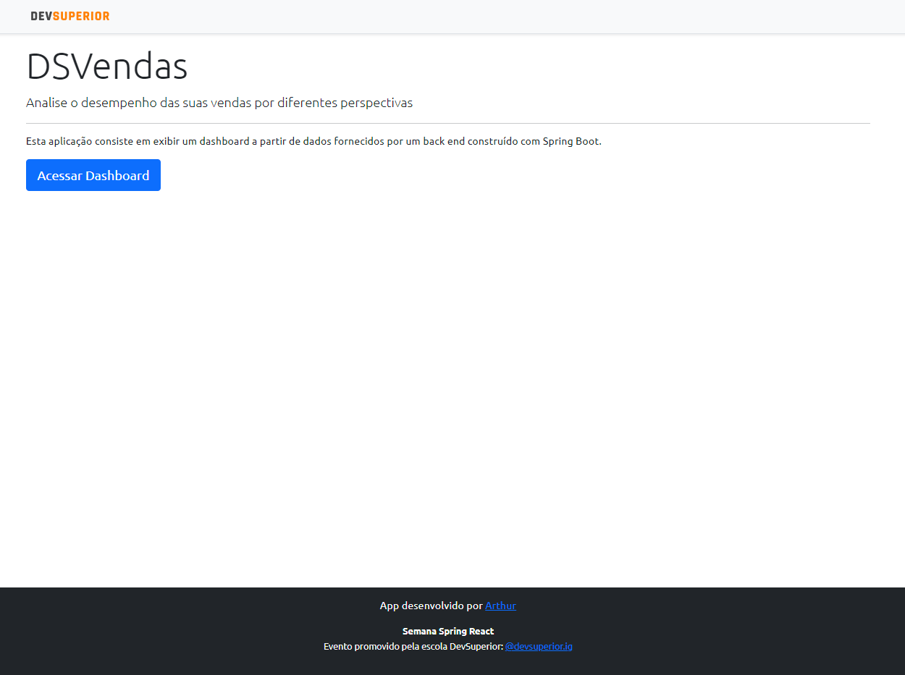
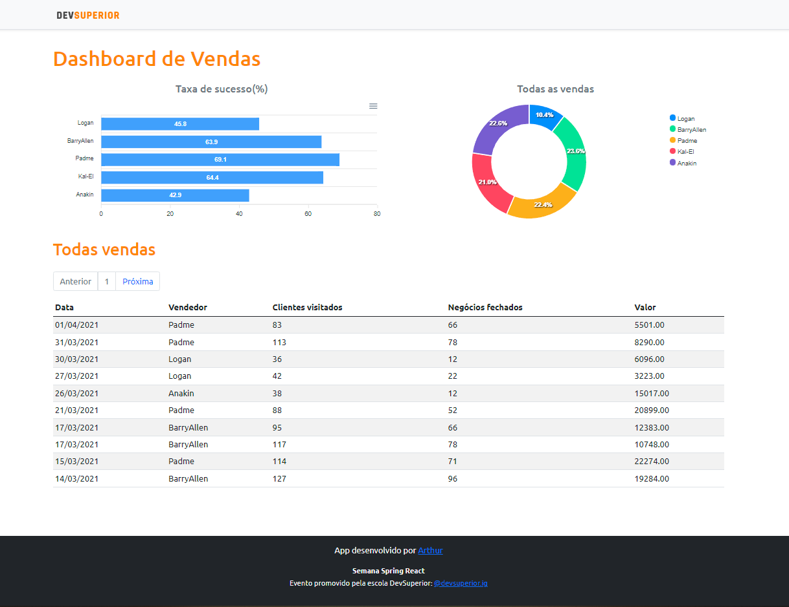

  

<h3 align="center">DSVendas - SDS5</h3>

---

 A dashboard project made for study the Spring and React framework.
      

## 📝 Table of Contents

- [Preview](#Preview)
- [Prerequisites](#Prerequisites)
- [Usage](#usage)
- [Technology Stack](#tech_stack)
- [Authors](#authors)

## Preview

This project can be find online [here](https://dsvendas-pandaluk.netlify.app/).

  

  

## Prerequisites

This project utilizes Java 11 and React v17

## 🎈 Usage 

The project live is available here [DSVendas](https://dsvendas-pandaluk.netlify.app). He has two pages, a Home page describing the usage and the dashboard page with some data

## ⛏️ Built With 

- [Spring](https://spring.io/) - Backend Framework
- [React](https://reactjs.org/) - Web Framework
- [PostgreSQL](https://www.postgresql.org/) - Database

## ✍️ Authors 

- [@pandaluk](https://github.com/pandaluk) - Arthur Santos